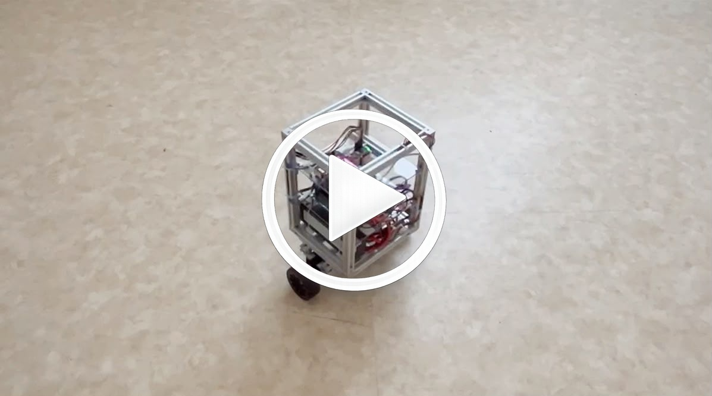
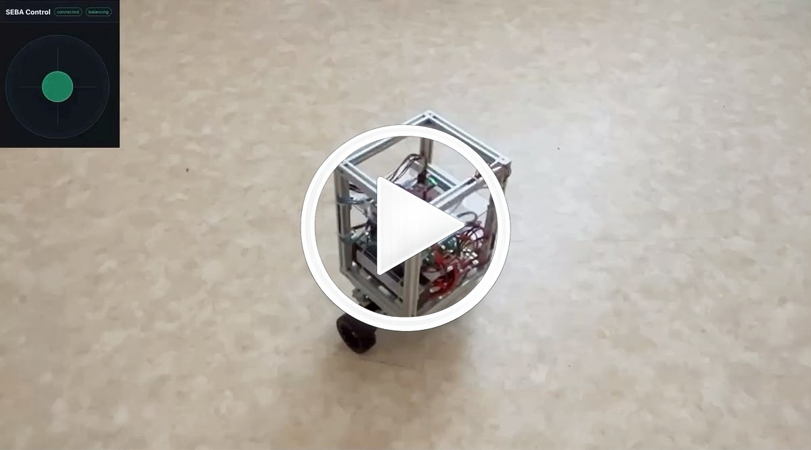
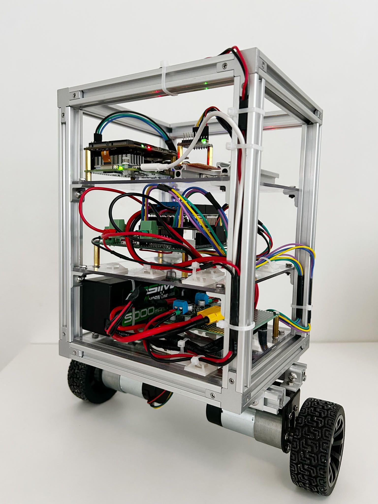
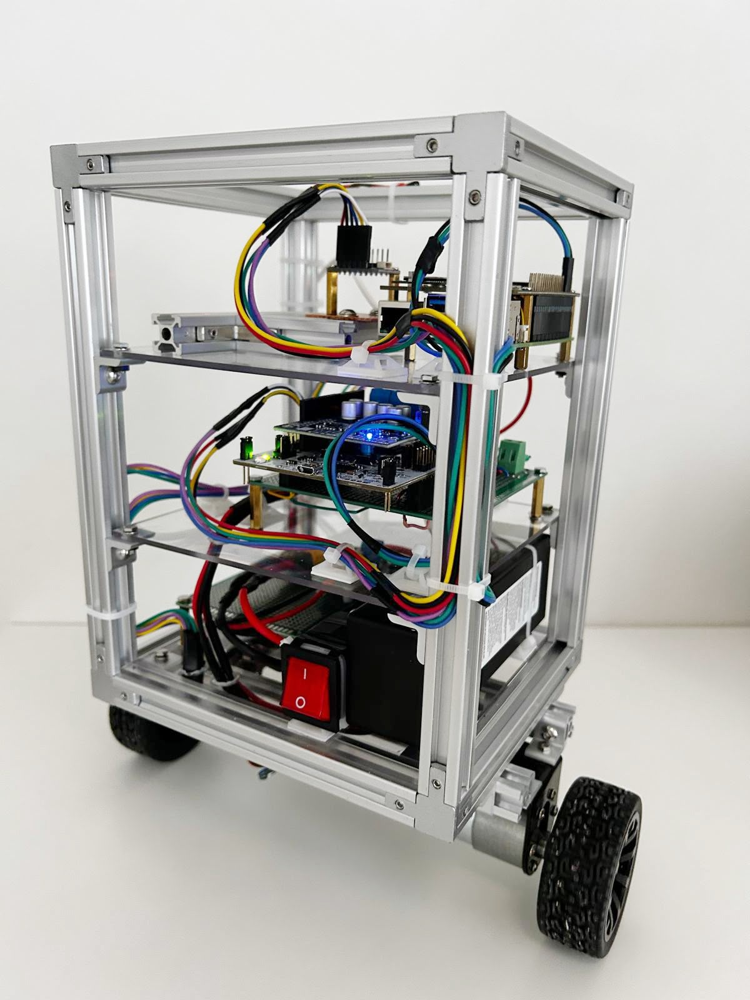
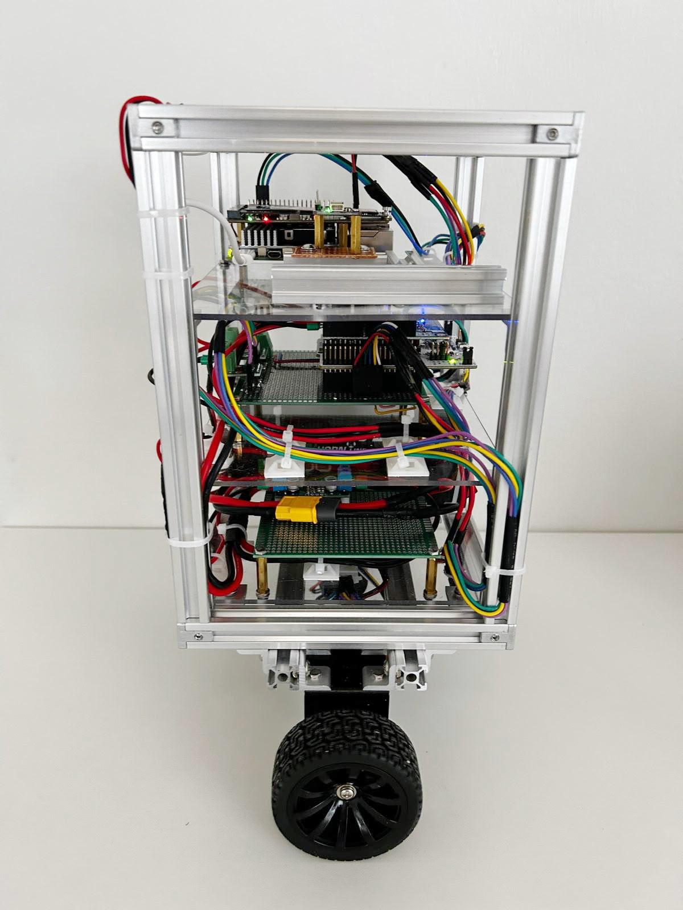
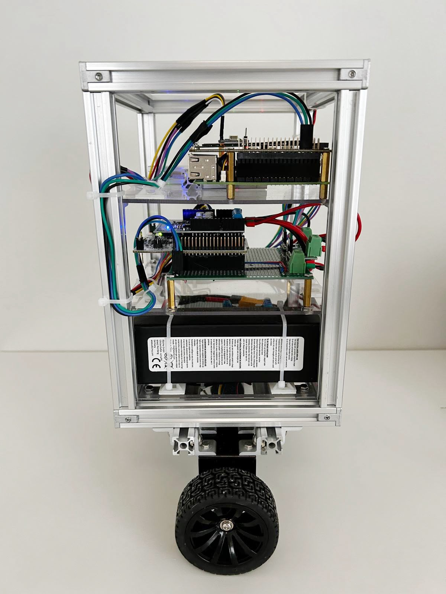
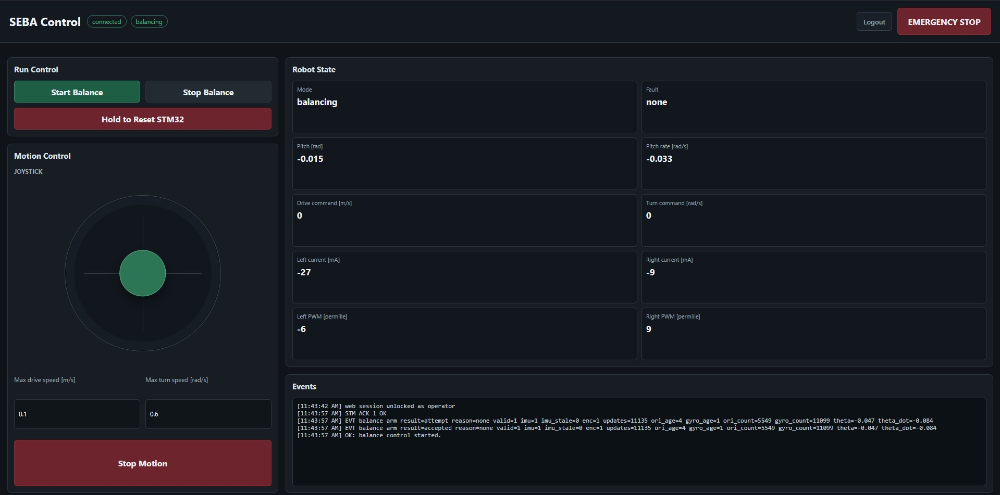
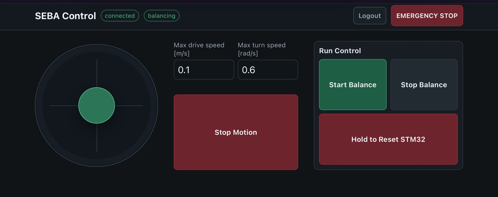
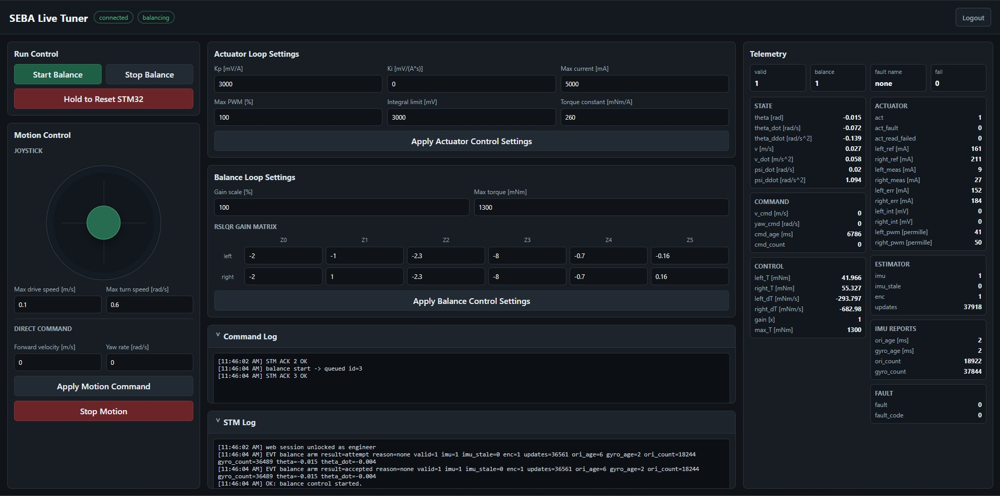

# SEBA-ROBOT

SEBA-ROBOT is a two-wheeled self-balancing robot project for control, embedded systems, and autonomous robotics development.

The current work covers the robot dynamics, balance and motion control, nonlinear simulation, built physical hardware, STM32 real-time firmware, and Raspberry Pi web runtime.

The physical robot has been implemented and validated with stable self-balancing, forward-velocity tracking, yaw-rate control, and closed-loop motor-current regulation.

---

## Demo

<table width="100%">
  <tr>
    <td width="50%" valign="top">
      <a href="https://youtu.be/SNxGYvboVcs">
        
      </a><br/>
      <strong>Stability and disturbance recovery.</strong><br/>
      Shows stable self-balancing and recovery when the physical robot is pushed forward and backward.
    </td>
    <td width="50%" valign="top">
      <a href="https://youtu.be/KeqCIQtGD3I">
        
      </a><br/>
      <strong>Command tracking.</strong><br/>
      Shows forward, backward, yaw-rate, and combined motion command tracking using the web joystick interface.
    </td>
  </tr>
</table>

---

## Gallery

### Robot

<table>
  <tr>
    <td width="50%">
      <br/>
      Figure 1. Front view of SEBA-ROBOT.
    </td>
    <td width="50%">
      <br/>
      Figure 2. Back view of SEBA-ROBOT.
    </td>
  </tr>
  <tr>
    <td width="50%">
      <br/>
      Figure 3. Left side view of SEBA-ROBOT.
    </td>
    <td width="50%">
      <br/>
      Figure 4. Right side view of SEBA-ROBOT.
    </td>
  </tr>
</table>

### Web Interfaces

<table>
  <tr>
    <td>
      <br/>
      Figure 5. Desktop operator control panel for balance control, joystick commands, telemetry, and STM32 events.
    </td>
  </tr>
  <tr>
    <td style="padding-top:6px;">
      <br/>
      Figure 6. Mobile landscape operator control panel with controller-style joystick and run controls.
    </td>
  </tr>
  <tr>
    <td style="padding-top:6px;">
      <br/>
      Figure 7. Engineering tuner for actuator settings, balance gains, live telemetry, and STM32 logs.
    </td>
  </tr>
</table>

---

## Current Implementation

The implemented work covers six main areas:

- **Robot modeling:** nonlinear forward, pitch, and yaw dynamics, together with a reduced model and linearization for control design
- **Motion control:** a robust servomechanism LQR controller for pitch stabilization, forward-velocity tracking, and yaw-rate tracking
- **Simulation and evaluation:** a nonlinear Simulink and Simscape Multibody model with four documented test cases, result plots, and animations
- **Hardware system:** built physical robot hardware, including power distribution, STM32 connections, motor driver, sensors, wiring, and mechanical electronics layout
- **STM32 firmware:** real-time PlatformIO firmware for state estimation, balance and motion control, actuator current control, telemetry, safety handling, motor control, encoder reading, IMU acquisition, and current sensing
- **Raspberry Pi platform:** Python web server with local login, an operator control panel, engineering tuner, STM32 UART communication, telemetry display, command handling, staged Ubuntu setup, autostart service, and hotspot fallback support

---

## Documentation

### Dynamics and Control

[**Dynamics and Velocity-Tracking Control Model**](control/README.md)

Nonlinear robot dynamics, reduced control model, linearization, and robust servomechanism LQR controller design.

### Simulink Simulation

[**Simulink Simulation**](control/simulink/README.md)

Simulation model configuration, controller settings, test procedures, result plots, and animations.

### Hardware

[**Hardware System**](hardware/README.md)

Electrical hardware, power distribution, STM32 connections, motor driver, sensors, wiring, and physical construction.

### STM32 Firmware

[**STM32 Firmware**](firmware/stm32/README.md)

Real-time PlatformIO firmware for STM32G474RE sensing, state estimation, balance and motion control, actuator control, telemetry, serial commands, and safety behavior.

### Raspberry Pi Platform

[**Raspberry Pi Platform**](raspberry-pi/README.md)

Raspberry Pi setup and web runtime for local login, the operator control panel, engineering tuner, STM32 UART communication, telemetry, staged Ubuntu setup, autostart service, and hotspot fallback support.

---

## Simulation Results

The controller is evaluated using four closed-loop simulation test cases:

- [balance recovery](control/simulink/README.md#1-balance-recovery)
- [forward-velocity tracking](control/simulink/README.md#2-forward-velocity-tracking)
- [yaw-rate tracking](control/simulink/README.md#3-yaw-rate-tracking)
- [combined motion tracking](control/simulink/README.md#4-combined-motion-tracking)

The combined-motion test evaluates simultaneous forward-velocity and yaw-rate tracking while maintaining balance.


https://github.com/user-attachments/assets/7f919d5b-edf8-4cf7-b23b-a4d0317f5f51

Plots and simulation animations for all four test cases are available in the [simulation documentation](control/simulink/README.md#simulation-test-cases).

---

## Repository Structure

```text
seba-robot/
|-- control/
|   |-- README.md
|   `-- simulink/
|       |-- README.md
|       |-- seba_control.slx
|       `-- results/
|-- hardware/
|   `-- README.md
|-- firmware/
|   `-- stm32/
|       |-- README.md
|       |-- platformio.ini
|       `-- src/
|-- raspberry-pi/
|   |-- README.md
|   |-- requirements.txt
|   |-- seba_pi/
|   |-- setup/
|   |   `-- README.md
|   |-- systemd/
|   |-- web/
|   |   |-- README.md
|   |   |-- apps/
|   |   |-- http_handler.py
|   |   `-- server.py
|   |-- hotspot.sh
|   `-- install.sh
|-- robot/
|   |-- photos/
|   |-- screenshots/
|   `-- thumbnails/
|-- LICENSE
`-- README.md
```

- `control/` contains the robot dynamics and controller documentation.
- `control/simulink/` contains the simulation model, simulation documentation, and test results.
- `hardware/` contains documentation for the built robot hardware, including electronics, wiring, power distribution, and physical construction.
- `firmware/stm32/` contains the STM32G474RE PlatformIO firmware.
- `raspberry-pi/` contains the Raspberry Pi setup tooling, web server, local web authentication, operator control panel, engineering tuner, serial-link backend, NetworkManager hotspot tooling, and systemd service templates.
- `robot/` contains photos of the completed physical robot, web-interface screenshots, and demo-video thumbnails.

---

## Running the Simulation

The model was developed and tested using MATLAB R2025b with Simulink, Simscape, and Simscape Multibody.

Clone the repository:

```bash
git clone https://github.com/ShahinFi/seba-robot.git
cd seba-robot
```

Open the following model in MATLAB:

```text
control/simulink/seba_control.slx
```

No separate initialization script is required.

See the [simulation documentation](control/simulink/README.md) for the software requirements, model settings, and instructions for reproducing the four test cases.

---

## Building the STM32 Firmware

The STM32 firmware is a PlatformIO project for the NUCLEO-G474RE board.

```bash
cd firmware/stm32
pio run
```

See the [STM32 firmware documentation](firmware/stm32/README.md) for upload, monitor, serial commands, telemetry, control modules, and safety behavior.

---

## Running the Raspberry Pi Platform

The Raspberry Pi platform provides the robot web interfaces and setup tooling.

For a reproducible Raspberry Pi setup, use the staged installer:

```bash
bash raspberry-pi/install.sh all
```

For a manual web-server run after setup:

```bash
.venv/bin/python3 raspberry-pi/web/server.py --serial /dev/ttyAMA0 --port 8080
```

The operator control panel is available at `/control`, and the engineering tuner is available at `/tuner`.

See the [Raspberry Pi platform documentation](raspberry-pi/README.md) for setup and web-runtime documentation links.

---

## Planned Work

Future development will focus on:

- battery and power-status reporting
- localization, mapping, UWB positioning, and navigation
- ROS 2 and high-level autonomous behavior on the Raspberry Pi

---

## License

This project is licensed under the [MIT License](LICENSE).
