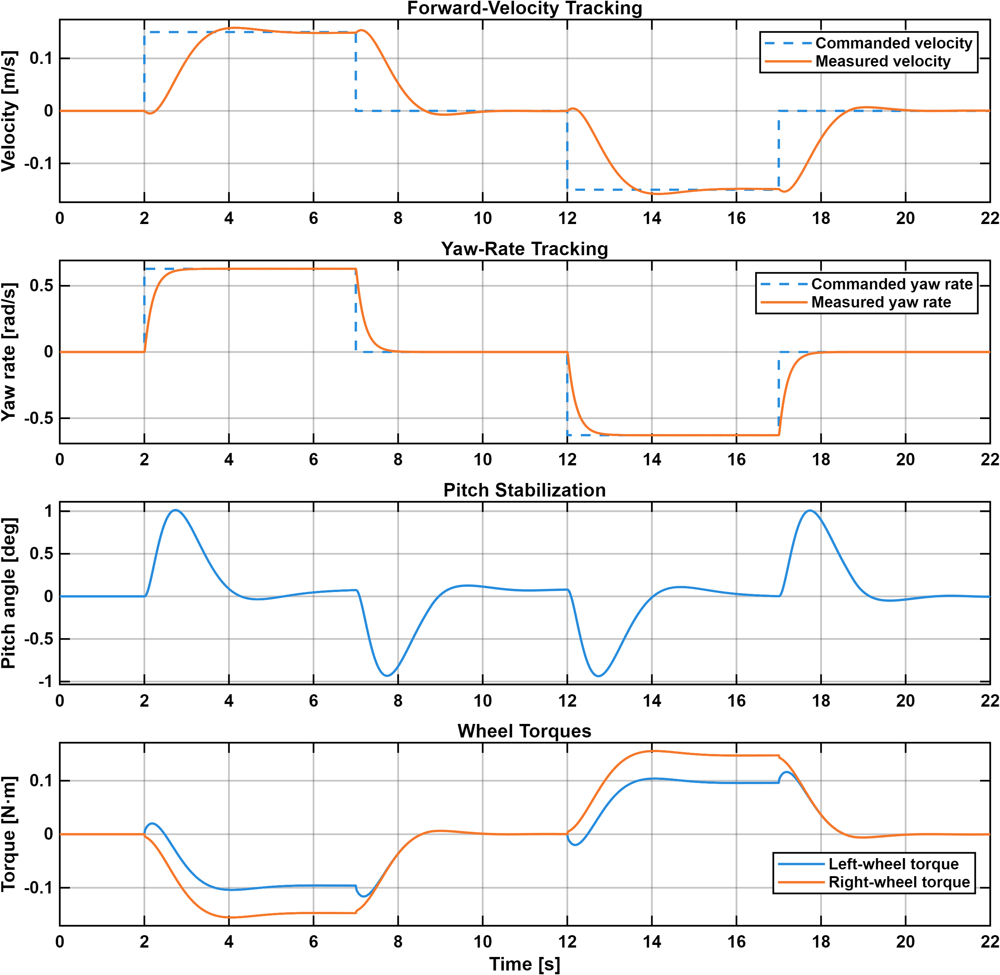

# SEBA-ROBOT

SEBA-ROBOT is a two-wheeled self-balancing robot project for control, embedded systems, and autonomous robotics development.

The current work covers the robot dynamics, balance and motion control, nonlinear simulation, physical hardware, and STM32 firmware bring-up.

---

## Current Implementation

The implemented work covers five main areas:

- **Robot modeling:** nonlinear forward, pitch, and yaw dynamics, together with a reduced model and linearization for control design
- **Motion control:** a robust servomechanism LQR controller for pitch stabilization, forward-velocity tracking, and yaw-rate tracking
- **Simulation and evaluation:** a nonlinear Simulink and Simscape Multibody model with four documented test cases, result plots, and animations
- **Hardware system:** documented electrical hardware, power distribution, STM32 pin connections, motor driver, sensors, and physical construction
- **STM32 firmware:** PlatformIO firmware for hardware bring-up, motor control, encoder reading, IMU acquisition, current sensing, and serial console commands

---

## Documentation

### Dynamics and Control

[**Dynamics and Velocity-Tracking Control Model**](control/README.md)

Nonlinear robot dynamics, reduced control model, linearization, and robust servomechanism LQR controller design.

### Simulink Simulation

[**Simulink Simulation**](control/simulink/README.md)

Simulation model configuration, controller settings, test procedures, result plots, and animations.

### Hardware

[**Hardware System**](hardware/README.md)

Electrical hardware, power distribution, STM32 connections, motor driver, sensors, wiring, and physical construction.

### STM32 Firmware

[**STM32 Firmware**](firmware/stm32)

PlatformIO firmware for STM32G474RE hardware bring-up and low-level robot I/O.

---

## Simulation Results

The controller is evaluated using four closed-loop simulation test cases:

- [balance recovery](control/simulink/README.md#1-balance-recovery)
- [forward-velocity tracking](control/simulink/README.md#2-forward-velocity-tracking)
- [yaw-rate tracking](control/simulink/README.md#3-yaw-rate-tracking)
- [combined motion tracking](control/simulink/README.md#4-combined-motion-tracking)

The combined-motion test evaluates simultaneous forward-velocity and yaw-rate tracking while maintaining balance.



https://github.com/user-attachments/assets/7f919d5b-edf8-4cf7-b23b-a4d0317f5f51

Plots and simulation animations for all four test cases are available in the [simulation documentation](control/simulink/README.md#simulation-test-cases).

---

## Repository Structure

```text
seba-robot/
|-- control/
|   |-- README.md
|   `-- simulink/
|       |-- README.md
|       |-- seba_control.slx
|       `-- results/
|-- docs/
|-- firmware/
|   `-- stm32/
|       |-- platformio.ini
|       `-- src/
|-- hardware/
|   `-- README.md
|-- LICENSE
`-- README.md
```

- `control/` contains the robot dynamics and controller documentation.
- `control/simulink/` contains the simulation model, simulation documentation, and test results.
- `docs/` contains supporting project documents.
- `firmware/stm32/` contains the STM32G474RE PlatformIO firmware.
- `hardware/` contains the documented electrical hardware, wiring, power system, and physical construction.

---

## Running the Simulation

The model was developed and tested using MATLAB R2025b with Simulink, Simscape, and Simscape Multibody.

Clone the repository:

```bash
git clone https://github.com/ShahinFi/seba-robot.git
cd seba-robot
```

Open the following model in MATLAB:

```text
control/simulink/seba_control.slx
```

No separate initialization script is required.

See the [simulation documentation](control/simulink/README.md) for the software requirements, model settings, and instructions for reproducing the four test cases.

---

## Building the STM32 Firmware

The STM32 firmware is a PlatformIO project for the NUCLEO-G474RE board.

```bash
cd firmware/stm32
pio run
```

---

## Planned Work

Future development will focus on:

- closed-loop embedded balance and motion control on the physical robot
- motor-current regulation and actuator-control validation
- encoder and IMU state estimation
- physical validation of the balance and motion controller
- localization, mapping, UWB positioning, and navigation

---

## License

This project is licensed under the [MIT License](LICENSE).
