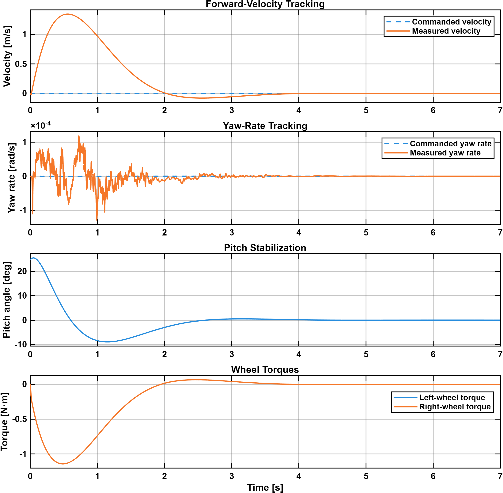
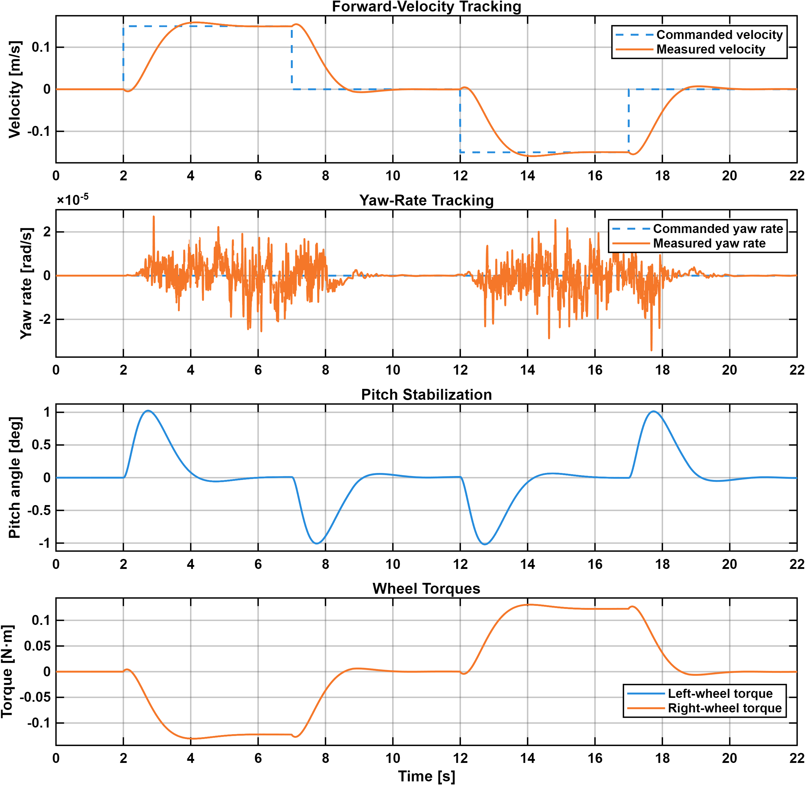
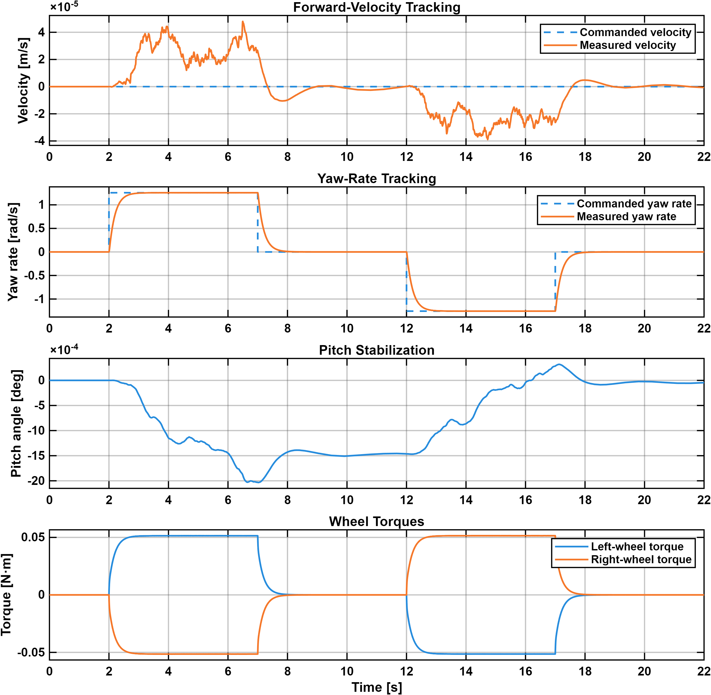
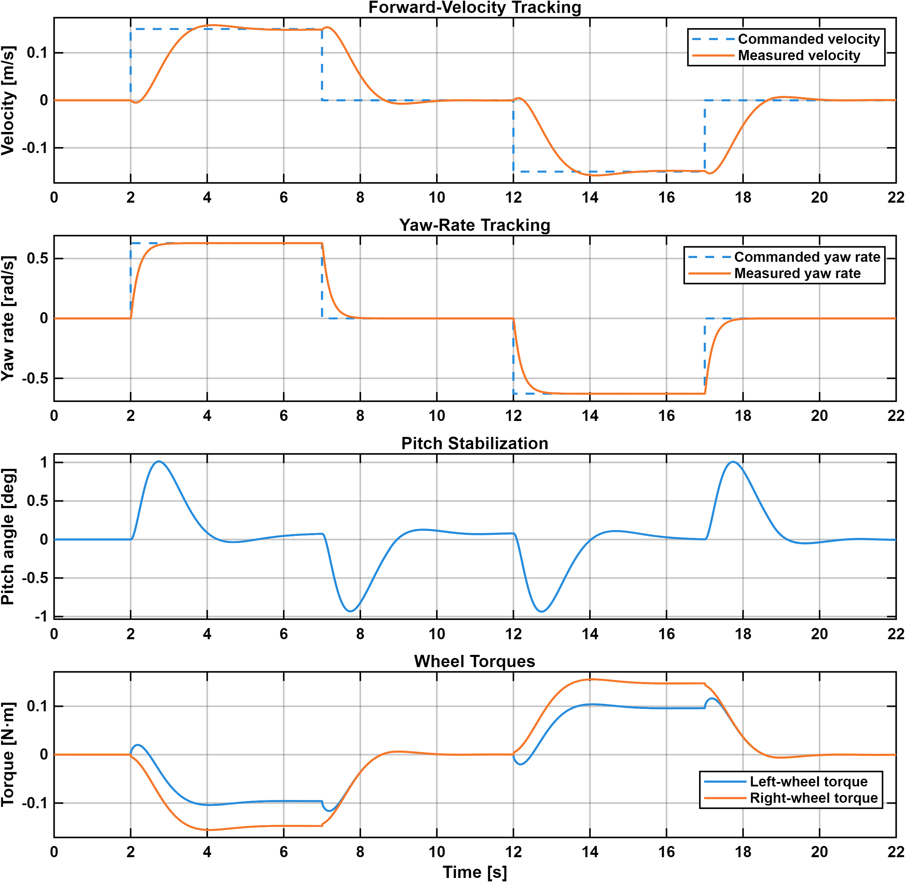

# Simulink Simulation

This directory contains the nonlinear Simulink and Simscape Multibody simulation of SEBA-ROBOT together with its robust servomechanism LQR motion controller.

The model is organized as a closed-loop simulation consisting of:

- a nonlinear Simscape Multibody two-wheeled inverted-pendulum robot plant
- an RSLQR motion controller
- wheel-speed-based forward-velocity and yaw-rate feedback
- a motion-command generator for forward velocity and yaw rate
- centralized robot-parameter definition
- simulation signal logging and visualization

The controller stabilizes the body pitch while tracking commanded forward velocity and yaw rate through independent left- and right-wheel torque commands.

Four simulation test cases are provided to evaluate balance recovery, forward-velocity tracking, yaw-rate tracking, and combined motion tracking. Each test case includes a result plot and an animation of the corresponding multibody simulation.

The complete nonlinear dynamics, reduced velocity-control model, linearization, augmented-state formulation, and RSLQR controller derivation are documented in [`../README.md`](../README.md).

---

## Software Requirements

The model was developed and tested using MATLAB R2025b with:

- MATLAB
- Simulink
- Simscape
- Simscape Multibody

The controller gain is hardcoded for normal simulation, so Control System Toolbox is not required to run the model. It is required only when using the `lqr` function to recalculate the controller gain.

---

## Robot Parameters

The following rigid-body and physical parameters are used by the simulation and controller model:

| Parameter | Description | Value |
|---|---|---:|
| \(m_p\) | Body mass | \(2.90\ \mathrm{kg}\) |
| \(m_w\) | Mass of each wheel | \(0.050\ \mathrm{kg}\) |
| \(l_p\) | Wheel-axis to body center-of-mass distance | \(0.125\ \mathrm{m}\) |
| \(r_w\) | Wheel radius | \(0.035\ \mathrm{m}\) |
| \(W\) | Wheel center-to-center separation | \(0.10\ \mathrm{m}\) |
| \(I_{py}\) | Body pitch-axis moment of inertia | \(0.01752\ \mathrm{kg\,m^2}\) |
| \(I_{pz}\) | Body yaw-axis moment of inertia | \(0.00483\ \mathrm{kg\,m^2}\) |
| \(I_w\) | Wheel rolling-axis moment of inertia | \(3.0625\times10^{-5}\ \mathrm{kg\,m^2}\) |
| \(J_w\) | Wheel vertical-axis moment of inertia | \(1.90625\times10^{-5}\ \mathrm{kg\,m^2}\) |
| \(c\) | Wheel rotational damping coefficient | \(0.0005\ \mathrm{N\,m\,s/rad}\) |
| \(g\) | Gravitational acceleration | \(9.81\ \mathrm{m/s^2}\) |

---

## Multibody Plant Configuration

### Body and Wheel Geometry

The robot body is modeled as a rectangular rigid body with dimensions:

```text
0.10 m × 0.10 m × 0.25 m
```

Each wheel is modeled as a solid cylinder with a width of:

```text
0.030 m
```

### Wheel Revolute Joints

The left and right wheel revolute joints use the following internal-mechanics settings:

```text
Equilibrium position: 0 deg
Spring stiffness:     0
Damping coefficient:  0.0005 N·m·s/rad
```

---

## Wheel-Ground Contact

The ground is modeled as a fixed rigid plane. Each wheel interacts with the ground through an independent Spatial Contact Force block using the same contact parameters.

### Normal Force

```text
Method:                  Smooth Spring-Damper
Stiffness:               1e4 N/m
Damping:                 1e4 N/(m/s)
Transition-region width: 2 mm
```

### Frictional Force

```text
Method:                       Smooth Stick-Slip
Static-friction coefficient:  100
Dynamic-friction coefficient: 1
Critical velocity:            1e-3 m/s
```

These values are numerical parameters of the current contact model and have not been obtained through experimental wheel-ground identification.

---

## Solver Configuration

The simulation uses:

```text
Solver type: Variable-step
Solver:      daessc
```

The remaining solver settings use their configured automatic or default values.

---

## RSLQR Controller

The simulation uses the robust servomechanism LQR controller derived in [`../README.md`](../README.md).

The controller receives the robot state and motion commands, calculates the left- and right-wheel torque-rate commands, and integrates them to produce the wheel torque commands applied to the Robot Plant.

### Controller Gain

The `RSLQR Gain Solver` block inside the `RSLQR Controller` subsystem contains the LQR weighting matrices and controller-gain calculation.

The weighting matrices are:

```matlab
Q = diag([
    70;    % Forward-velocity tracking error
    40;    % Yaw-rate tracking error
    70;    % Forward acceleration
    1;     % Pitch rate
    1;     % Pitch acceleration
    1      % Yaw acceleration
]);

R = 20*eye(2);
```

Normal simulation uses the following hardcoded gain:

```matlab
K_c = [
    -1.32287565553227, -1.00000000000000, -1.89671635710169, -4.14420766193970, -0.575208158135163, -0.162330467920892;
    -1.32287565553227,  1.00000000000000, -1.89671635710170, -4.14420766193971, -0.575208158135163,  0.162330467920892
];
```

The first row produces the left-wheel torque-rate command, and the second row produces the right-wheel torque-rate command.

The `lqr` calculation in the `RSLQR Gain Solver` block is disabled during normal simulation. It is enabled only when recalculating the gain after changing the robot parameters or LQR weighting matrices. Control System Toolbox is required only for this recalculation.

---

## Motion Command Profile

The Motion Command Profile block outputs:

```math
r =
\begin{bmatrix}
v_{\mathrm{cmd}} \\
\dot{\psi}_{\mathrm{cmd}}
\end{bmatrix}
```

The MATLAB Function code in this block is changed according to the validation scenario being run.

The command changes are implemented as discrete levels rather than ramps so the transient response, tracking behavior, overshoot, and settling behavior remain visible in the results.

---

## Logged Signals

The following named vector signals are logged:

```text
command = [v_cmd; psi_dot_cmd]
state   = [v; theta; theta_dot; psi_dot]
torques = [T_L; T_R]
```

The model uses:

```text
Signal logging variable:  logsout
Single simulation output: out
Save format:              Dataset
Dataset signal format:    timeseries
```

---

## Running the Simulation

No separate initialization script is required. All parameters and controller settings needed to run the simulation are defined within `seba_control.slx`.

Open:

```text
seba_control.slx
```

Run the model from MATLAB using:

```matlab
out = sim(bdroot);
```

Retrieve the logged dataset using:

```matlab
logs = out.logsout;
```

Retrieve the named signals using:

```matlab
command = logs.getElement('command').Values;
state   = logs.getElement('state').Values;
torques = logs.getElement('torques').Values;
```

---

## Simulation Test Cases

Four test cases are provided:

1. balance recovery
2. forward-velocity tracking
3. yaw-rate tracking
4. combined motion tracking

For each test, replace the code in the `Motion Command Profile` MATLAB Function block with the corresponding command-generation code shown below.

The result plots show the commanded and measured motion, body pitch response, and left- and right-wheel torque commands. The linked animations show the corresponding motion of the Simscape Multibody robot.

---

## 1. Balance Recovery

This test evaluates recovery from a nonzero initial body pitch while both motion commands remain zero.

```text
Initial pitch angle: 25 deg
Simulation stop time: 7 s
```

Set the controller pitch-state initial condition to:

```matlab
25*pi/180
```

Set the physical Robot Plant to the same initial pitch orientation.

Use the following command profile:

```matlab
function r = fcn(t)
%#codegen

v_cmd = 0;
psi_dot_cmd = 0;

r = [v_cmd; psi_dot_cmd];

end
```

### Results



[View the balance-recovery animation](results/balance_recovery.mp4)

---

## 2. Forward-Velocity Tracking

This test evaluates positive and negative forward-velocity tracking while the yaw-rate command remains zero.

```text
Initial pitch angle: 0 deg
Simulation stop time: 22 s
```

Use the following command profile:

```matlab
function r = fcn(t)
%#codegen

if t < 2
    v_cmd = 0;
elseif t < 7
    v_cmd = 0.15;
elseif t < 12
    v_cmd = 0;
elseif t < 17
    v_cmd = -0.15;
else
    v_cmd = 0;
end

psi_dot_cmd = 0;

r = [v_cmd; psi_dot_cmd];

end
```

### Results



[View the forward-velocity tracking animation](results/velocity_tracking.mp4)

---

## 3. Yaw-Rate Tracking

This test evaluates positive and negative yaw-rate tracking while the forward-velocity command remains zero.

```text
Initial pitch angle: 0 deg
Simulation stop time: 22 s
```

Use the following command profile:

```matlab
function r = fcn(t)
%#codegen

v_cmd = 0;

if t < 2
    psi_dot_cmd = 0;
elseif t < 7
    psi_dot_cmd = 2*pi/5;
elseif t < 12
    psi_dot_cmd = 0;
elseif t < 17
    psi_dot_cmd = -2*pi/5;
else
    psi_dot_cmd = 0;
end

r = [v_cmd; psi_dot_cmd];

end
```

### Results



[View the yaw-rate tracking animation](results/yaw_rate_tracking.mp4)

---

## 4. Combined Motion Tracking

This test evaluates simultaneous forward-velocity and yaw-rate tracking.

```text
Initial pitch angle: 0 deg
Simulation stop time: 22 s
```

Use the following command profile:

```matlab
function r = fcn(t)
%#codegen

if t < 2
    v_cmd = 0;
    psi_dot_cmd = 0;

elseif t < 7
    v_cmd = 0.15;
    psi_dot_cmd = pi/5;

elseif t < 12
    v_cmd = 0;
    psi_dot_cmd = 0;

elseif t < 17
    v_cmd = -0.15;
    psi_dot_cmd = -pi/5;

else
    v_cmd = 0;
    psi_dot_cmd = 0;
end

r = [v_cmd; psi_dot_cmd];

end
```

### Results



[View the combined motion-tracking animation](results/combined_motion_tracking.mp4)

---

## Modeling Scope

The simulation focuses on the robot rigid-body dynamics, wheel-ground interaction, motion control, and command tracking.

The presented results correspond to the documented robot parameters, controller settings, contact model, solver configuration, command profiles, simulation durations, and initial conditions.

The wheel-ground contact and friction values are simulation parameters rather than experimentally identified material properties.

Hardware-specific effects such as sensor noise, actuator saturation, motor electrical dynamics, backlash, communication delay, and battery-voltage variation are outside the current simulation scope.